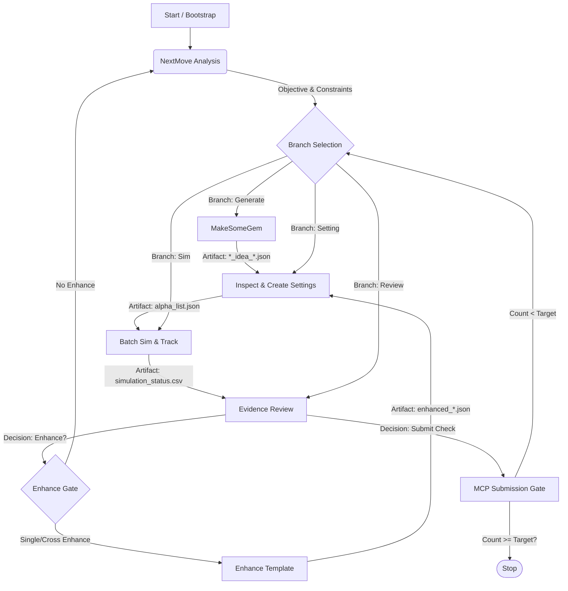

# Ralph Loop Architecture (Reference Document)

This document captures the logic, data flow, and state management of the "Ralph Daily Loop" (`brain-deepExplore`), which orchestrates five domain skills into a continuous quant research workflow.

## 1. System Overview

**Objective**: Automated, daily iterative research loop that generates, refines, and simulates Alphas until a submission target (e.g., 4 submit-ready Alphas) is met.

**Core Philosophy**:
- **Artifact-Driven**: Steps communicate via files (JSON/CSV), not memory variables.
- **State-Managed**: A central `loop_state.json` tracks the current day's progress, iteration count, and branch selection.
- **Strict Orchestration**: Only specific skills are allowed; no external branches.

---

## 2. Prerequisites & Configuration

Before running any component or the full loop, ensure the following are configured:

### A. Authentication
*   **BRAIN Platform**: `brain-mcp` (or equivalent tool) must be authenticated.
*   **Auth Token**: Found in `~/.brain_credentials` (auto-generated by `mcp-brain-api authenticate`) or environment variables `BRAIN_EMAIL` / `BRAIN_PASSWORD`.

### B. API Keys (LLM)
*   **Provider**: OpenAI, Anthropic, or DeepSeek (depending on `config.json` settings).
*   **Environment Variables**: `OPENAI_API_KEY` (or `ANTHROPIC_API_KEY`, etc.) must be set in the active terminal or `.env` file.
*   **Reason**: Required by `brain-makeSomeGem` (Idea Generation), `brain-enhance-template` (Optimization), and `brain-nextMove-analysis` (Strategy Reasoning).

### C. Configuration Files
*   **`user_config.json`**: Located in `untracked/`. Defines workspace paths (e.g., `workspace_root`, `output_dir`).
*   **`sim_options_snapshot.json`**: (Optional but recommended) Locally cached valid simulation options to speed up `brain-inspectRawTemplate`.

### D. Environment
*   **Python**: Python 3.10+ (Recommended 3.13 per current workspace).
*   **Dependencies**: All `requirements.txt` from submodules installed.
*   **Virtual Environment**: Active (`.venv` or similar).

---

## 3. Component Data Flow (The "Pipeline")

The loop follows a cyclic graph, driven by the `ralph_runner.py` or manual steps.

---

## 4. Skill-by-Skill Specifications

### A. brain-nextMove-analysis (Diagnosis)
*   **Role**: Daily strategist. Determines what to research today based on leaderboards and constraints.
*   **Parameters (Input)**:
    *   `--objective`: High-level goal (e.g., "diverse submission").
    *   `--constraints`: Limits (e.g., "max turnover 0.05", "region EUR").
*   **Inputs**: BRAIN MCP data (Competitions, User Alphas).
*   **Outputs**: 
    *   State update: `daily_diagnose.objective`, `daily_diagnose.constraints`.
*   **Monitoring**: `loop_state.json` -> `daily_diagnose.done` flag.

### B. brain-makeSomeGem (Generator)
*   **Role**: Generates raw alpha expressions and idea templates.
*   **Parameters (Input)**:
    *   `--region`: Target region (e.g., `EUR`, `USA`, `GLB`).
    *   `--delay`: Simulation delay (e.g., `1`, `0`).
    *   `--dataset-id`: Dataset ID (e.g., `fundamental6`, `analyst45`).
    *   `--universe`: Investment universe (e.g., `TOP3000`, `TOP1200`).
    *   `--data-type`: `MATRIX` or `VECTOR` (optional, default `MATRIX`).
    *   `--instrument-type`: (optional, default `EQUITY`).
    *   `--detached`: Run in background (recommended for long tasks).
*   **Inputs**: Region, Delay, Universe, Dataset ID (from NextMove).
*   **Outputs**:
    *   `*_idea_*.json` (Template + Expressions)
    *   `final_expressions.json` (List of strings)
    *   Logs: `stdout.log`, `stderr.log` (in detached task folder)
*   **Monitoring**: 
    *   Process: CLI `--status <task_id>` (PID check).
    *   Artifacts: Existence of `final_expressions.json`.

### C. brain-inspectRawTemplate-create-Setting (Assembler)
*   **Role**: Parses idea files, validates expressions, and applies simulation settings (Universe, Neutralization, Decay).
*   **Parameters (Input)**:
    *   `--file`: Path to distinct `*_idea_*.json` file.
    *   `--force-fetch-options`: (optional) Refresh platform sim options.
    *   `--settings_json` (for Build Step): JSON string with concrete settings (neutralization, decay, etc.).
*   **Inputs**:
    *   `*_idea_*.json` (Must match filename pattern `..._delay<N>_idea_...`).
    *   `sim_options_snapshot.json` (Platform valid options).
*   **Decision**: User/Agent selects setting combinations from `settings_candidates.json`.
*   **Outputs**:
    *   `idea_context.json` (Parsed intermediate)
    *   `settings_candidates.json` (Options)
    *   `alpha_list.json` (Final executable list for Sim)
*   **Monitoring**: File existence in `processed_templates/<idea_name>/`.

### D. brain-enhance-template (Optimizer)
*   **Role**: Improving alphas via LLM (Single or Cross/Crossover).
*   **Parameters (Input)**:
    *   `--idea-json` / `--idea-json-list`: Input template files.
    *   `--enhance-mode`: `single` or `cross`.
    *   `--enhance-style`: `conservative` or `balanced` or `aggressive`.
    *   `--detached`: Run in background.
*   **Inputs**: 
    *   `*_idea_*.json` (Source template).
    *   Enhance configuration (Mode, Style).
*   **Outputs**:
    *   `enhanced_templates_*.json`
    *   `enhanced_final_expressions_*.json`
*   **Gap**: Enhanced outputs are not directly consumable by *Inspect* without manual bridging (naming convention mismatch).
*   **Monitoring**: Detached task logs.

### E. brain-simAlphasinBatch-and-track (Validator)
*   **Role**: Batch execution of alphas on WorldQuant BRAIN platform.
*   **Parameters (Input)**:
    *   `--alpha-json`: Path to `alpha_list.json`.
    *   `--output-csv`: Keep consistent for resume (e.g., `simulation_status.csv`).
    *   `--batch-size`: Alphas per API call (default 5).
    *   `--concurrency`: Parallel batch requests (default 1).
    *   `--detached`: Run in background.
*   **Inputs**: `alpha_list.json`.
*   **Outputs**: 
    *   `simulation_status.csv` (Source of Truth).
    *   Detached task logs.
*   **Features**: Fingerprint-based resume (skips already simulated alphas in the same CSV).
*   **Monitoring**: 
    *   CSV updates (polling line count/status columns).
    *   CLI `--status <task_id>`.

---

## 4. The Orchestrator (Ralph)

### State Management (`loop_state.json`)
The central brain of the loop.
*   **Fields**:
    *   `day_key`: Partition by NY date.
    *   `iteration`: Current loop counter.
    *   `artifacts`: Paths to current active files (handoff pointers).
    *   `loop_units`: Queue of queued actions (`generate, setting, sim, review`).
    *   `submit_gate`: Count of validated submission-ready alphas.

### Runner Logic (`ralph_runner.py`)
*   **Mechanism**: executes one "Unit" at a time.
*   **Protocol**:
    1.  Reads `loop_state.json` to find next Unit.
    2.  Executes command template (Shell).
    3.  Waits for `<promise>COMPLETE</promise>` in stdout.
    4.  Updates State (Pass/Fail) -> Next Unit.
*   **Constraint**: Serial execution. The runner consumes units effectively in a single thread.

---

## 5. Critical Paths & Handoffs

1.  **Make -> Inspect**: The system relies on `auto-pick-artifacts` finding the *latest* `*_idea_*.json` by file modification time (`mtime`).
    *   *Risk*: Concurrency issues, picking wrong file if multiple generated.
2.  **Inspect -> Sim**: Explicit path passing of `alpha_list.json`.
3.  **Sim -> Review**: Explicit path passing of `simulation_status.csv`.
4.  **Enhance -> Inspect**: Currently broken/manual. Enhanced files don't naturally fit the `*_idea_*.json` naming regex required by Inspect skill.

## 6. Summary of Monitoring Points

To know the "health" of the system, one watches:
1.  **`loop_state.json`**: High-level progress (Iteration #, Units passed).
2.  **`simulation_status.csv`**: Alpha performance verification (Sharpe, Turnover).
3.  **Detached Task Folders**: Low-level execution logs (Python errors, API timeouts).
